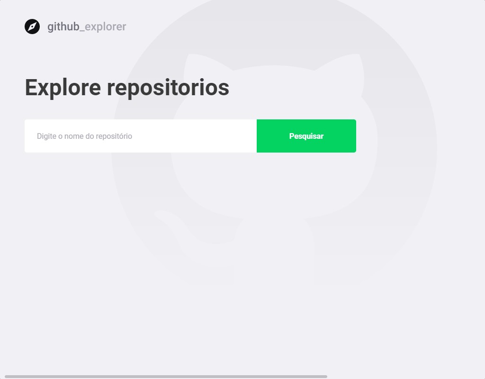
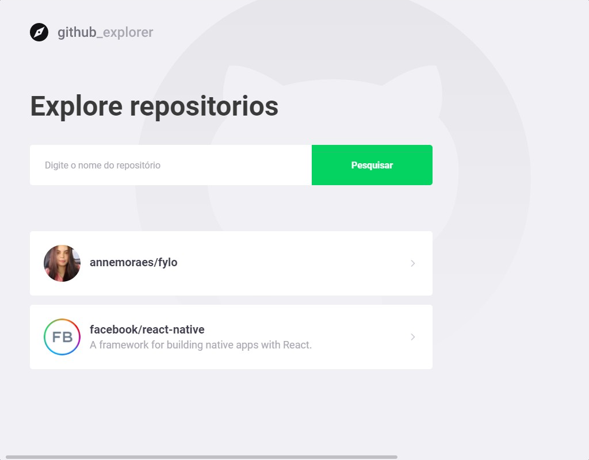
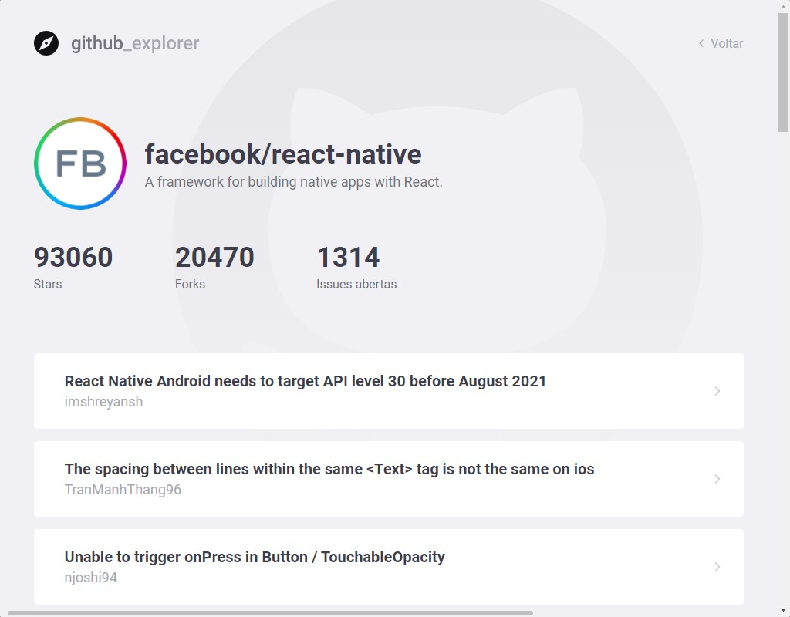

# github-explorer

### O projeto consome a API do GitHub para listar respositórios e informações sobre ele.
<h4>Confira: https://github-explorer.annemoraes.vercel.app/</h4> 

###

<h4>Use:</h4>

``
 yarn install ou npm install
``
###
``
  yarn start ou npm start
``

  

  

  

